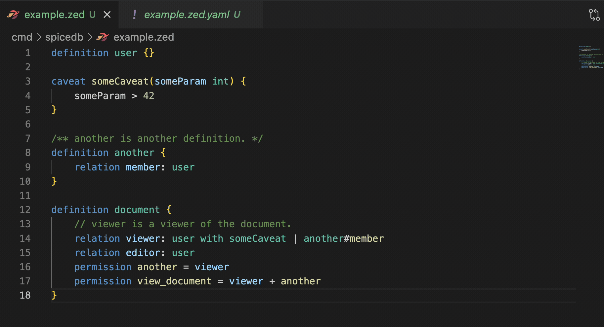
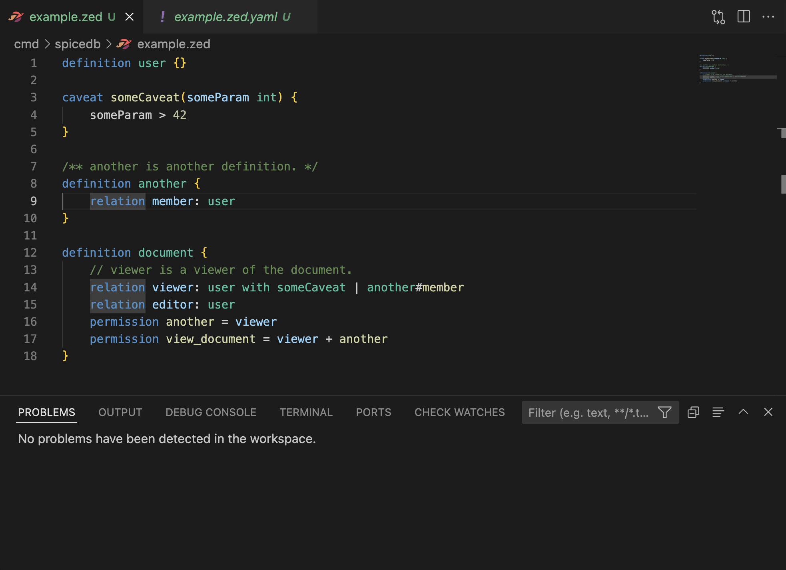
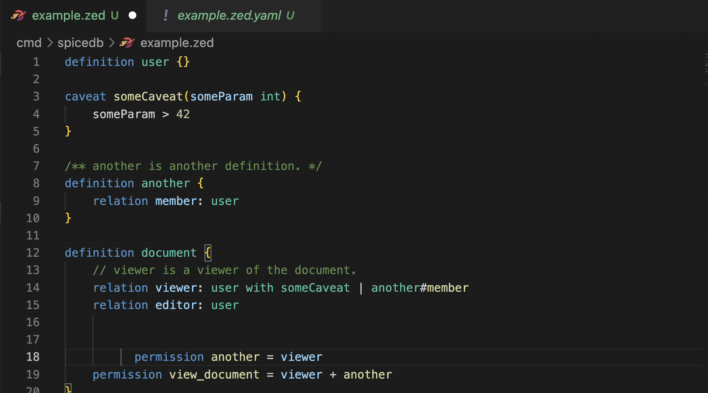
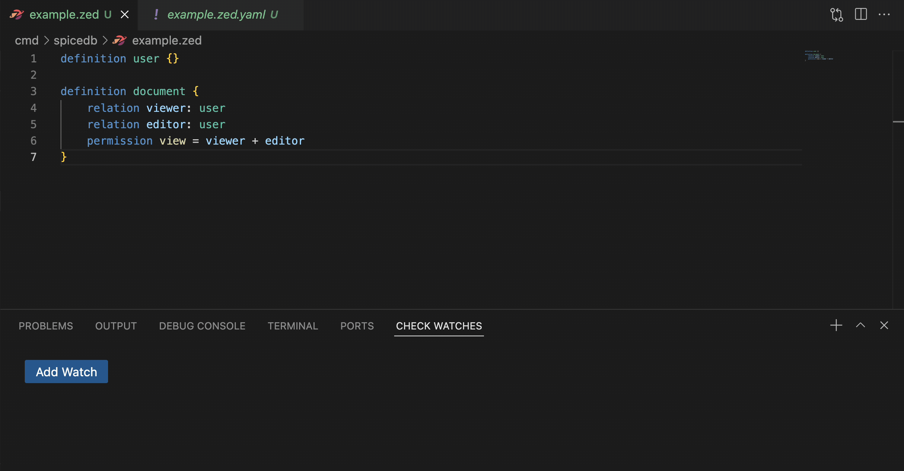

# SpiceDB for Visual Studio Code

Official VS Code extension providing syntax highlighting, semantic information, and additional UI components for working with [SpiceDB] [schema] and [relationships data].

This extension brings the [SpiceDB Playground] experience natively to VS Code.

[SpiceDB]: https://spicedb.io
[schema]: https://authzed.com/docs/spicedb/concepts/schema
[relationships data]: https://authzed.com/docs/spicedb/concepts/relationships
[SpiceDB Playground]: https://play.authzed.com

## Installation

The SpiceDB VS Code Extension can be installed from the [VS Code Extension Marketplace].

[VS Code Extension Marketplace]: https://marketplace.visualstudio.com/items?itemName=authzed.spicedb-vscode

### Updating SpiceDB

This extension uses SpiceDB's language server which is a part of the SpiceDB binary. You're prompted to install
SpiceDB if you haven't already the first time you run the extension. If there's a new language feature, you'll
need to update the installed SpiceDB binary to the most recent version to use that feature, according to whatever
installation mechanism you originally used.

## Features

### Syntax and Semantic Highlighting for SpiceDB Schema

### Real time validation and diagnostics

### Automatic formatting for SpiceDB Schema

### Built-in check watch

## Acknowledgments

The syntax for the CEL language (used in caveats) was copied from [vscode-cel](https://github.com/hmarr/vscode-cel).
